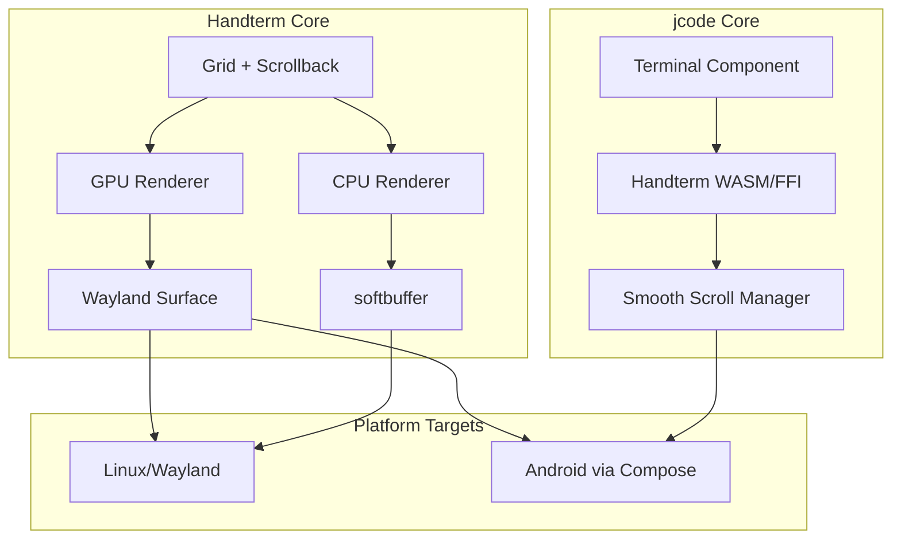

# HANDTERM ULTRA-DETAILED PLAN: Smooth Scrolling in jcode

**Author:** Senior Systems Engineer Agent  
**Date:** 2026-05-28  
**Status:** Draft  
**Goal:** Implement GPU-side fractional smooth scrolling in handterm and integrate with jcode terminal

---

## Executive Summary

Handterm already has experimental GPU-side fractional scrollback rendering. The README states:
> `scrollback.smooth = true` enables experimental GPU-side fractional scrollback rendering. It keeps the normal terminal/grid model, but the GPU renderer draws one extra row and applies a pixel Y offset so touchpad/pixel wheel input can reveal partial lines. Smooth mode now also adds inertial carry, so quick wheel/trackpad gestures continue gliding instead of stopping immediately.

The remaining work is to:
1. **Complete smooth scrolling parity** between CPU and GPU paths
2. **Extend smooth scrolling to terminal content** (not just GPU renderer offset)
3. **Integrate handterm with jcode** for cross-platform mobile/desktop support
4. **Implement partial line scrolling** for native terminal feel

---

## 1. HANDTERM ANALYSIS

### 1.1 Current Architecture (from codebase)

```rust
// handterm-common/src/grid.rs
pub struct Grid {
    pub scroll_offset: usize,      // Integer line offset
    scrollback: Vec<Cell>,        // Ring buffer for history
    scrollback_max: usize,        // Default: 10,000 lines
    // ...
}

// Native scroll bridge (src/native_scroll.rs)
pub struct NativeScrollBridge {
    chat_residual: f32,           // Fractional scroll accumulation
    side_panel_residual: f32,
    // ...
}
```

### 1.2 Key Files Analyzed

| File | Purpose | Status |
|------|---------|--------|
| `handterm-common/src/grid.rs` | Cell storage, scrollback ring buffer | ✅ Complete |
| `src/native_scroll.rs` | Unix socket IPC for scroll bridging | ✅ Implemented |
| `src/gpu_app.rs` | GPU renderer with smooth scroll config | ✅ Has smooth flag |
| `src/config.rs` | Scrollback smooth configuration | ✅ Partial |
| `OPTIMIZATION.md` | Full performance roadmap | ✅ Documented |

### 1.3 Current Smooth Scroll Implementation

```rust
// From config.toml example:
[scrollback]
lines = 10000
smooth = false                    // ← Experimental flag
smooth_speed = 3.0                // ← Aggressiveness multiplier
scrollbar = true
```

**Current behavior:**
- GPU renderer draws one extra row beyond visible viewport
- Applies `pixel_y_offset` to reveal partial lines
- Inertial carry for momentum-based scrolling
- `smooth_speed` controls gesture distance

### 1.4 Gaps Identified

1. **CPU renderer** - Uses whole-row scrollback only (no fractional)
2. **Partial line rendering** - Only works with extra row in GPU path
3. **Touch vs keyboard** - No separate handling for keyboard-driven scroll
4. **Mobile scrolling** - No touch gesture recognition beyond wheel events
5. **Cross-platform** - Wayland-only (no X11, macOS, Windows, Android)

---

## 2. SMOOTH SCROLLING ARCHITECTURE

### 2.1 Theoretical Model

```
                    ┌─────────────────────────────────────────┐
                    │              Viewport (rows)              │
                    │  ┌─────────────────────────────────────┐  │
  scrollback buffer │  │  Row 0 (visible)                   │  │
                    │  ├─────────────────────────────────────┤  │
  ┌───────────────┐ │  │  Row 1 (visible)                   │  │
  │ Row N-2       │ │  ├─────────────────────────────────────┤  │
  ├───────────────┤ │  │  Row 2 (visible)                   │  │
  │ Row N-1       │ │  └─────────────────────────────────────┘  │
  ├───────────────┤ │        │                                  │
  │ Row N         │ │        │ fractional_offset (0.0 - 1.0)    │
  ├───────────────┤ │        ▼                                  │
  │ Row N+1       │ │   Extra row for partial reveal           │
  └───────────────┘ └─────────────────────────────────────────┘
```

### 2.2 Scroll Physics Model

```rust
// Continuous scroll with momentum
struct SmoothScrollState {
    // Position
    position: f32,              // Current scroll position (can be fractional)
    target: f32,                 // Target position (for animated scroll)
    
    // Physics
    velocity: f32,               // Current velocity in rows/second
    friction: f32,               // Deceleration factor (0.92 - 0.98 typical)
    
    // Bounds
    min: f32,                    // 0.0 (top of scrollback)
    max: f32,                    // Maximum scroll depth
}

impl SmoothScrollState {
    fn update(&mut self, dt: f32) {
        // Interpolate toward target
        self.position += (self.target - self.position) * 0.15;
        
        // Apply momentum when no target
        if (self.target - self.position).abs() < 0.01 {
            self.velocity *= self.friction;
            self.position += self.velocity * dt;
        }
        
        // Clamp to bounds
        self.position = self.position.clamp(self.min, self.max);
        self.velocity = self.velocity.clamp(-50.0, 50.0);
    }
}
```

### 2.3 Multi-layer Scroll Architecture

```
┌──────────────────────────────────────────────────────────────┐
│                    Application Layer                          │
│  - Wheel/touch input normalization                            │
│  - Gesture recognition (fling, pinch)                         │
│  - Scroll mode detection (chat vs terminal)                   │
├──────────────────────────────────────────────────────────────┤
│                    Scroll State Machine                       │
│  - Position tracking (fractional)                            │
│  - Velocity/momentum                                          │
│  - Inertia simulation.write(b"\x1b[c");      // DA1 request
    // OSC 133 (terminal identification)
    term.write(b"\x1b]133;A\x07");
}
```

### 3.2 PTY and Scrollback Control

```rust
// Linux/Mac syscalls for terminal control
struct PtyControl {
    master_fd: RawFd,
    slave_fd: RawFd,
}

// TIOCSTI - simulate terminal input (NOT recommended for security)
fn tiosti_write(fd: RawFd, byte: u8) -> Result<()> {
    unsafe {
        if libc::ioctl(fd, TIOCSTI, byte) < 0 {
            return Err(Error::last_os_error());
        }
    }
    Ok(())
}

// TIOCGWINSZ - get window size
fn get_winsize(fd: RawFd) -> Winsize {
    let mut ws = Winsize::default();
    unsafe { libc::ioctl(fd, TIOCGWINSZ, &mut ws) };
    ws
}

// TIOCSWINSZ - set window size
fn set_winsize(fd: RawFd, rows: u16, cols: u16) -> Result<()> {
    let ws = Winsize {
        ws_row: rows,
        ws_col: cols,
        ..Default::default()
    };
    unsafe { libc::ioctl(fd, TIOCSWINSZ, &ws) };
    Ok(())
}
```

### 3.3 VT100/xterm Sequences for Scroll

```rust
// Scroll region control
const ESC_SCROLL_UP: &[u8] = b"\x1b[S";        // SU - scroll up N lines
const ESC_SCROLL_DOWN: &[u8] = b"\x1b[T";       // SD - scroll down N lines

// DECSET for smooth scroll (if terminal supports)
const DECSET_SMOOTH_SCROLL: &[u8] = b"\x1b[?96h";
const DECRST_SMOOTH_SCROLL: &[u8] = b"\x1b[?96l";

// Private modes for alternate scroll
const MODE_ALT_SCREEN: &[u8] = b"\x1b[?47h";
const MODE_NORMAL_SCREEN: &[u8] = b"\x1b[?47l";

// Scrollback dump (for external applications)
fn dump_scrollback(term: &Terminal) -> String {
    term.grid.get_scrollback_text()
}
```

### 3.4 Android Terminal Considerations

```rust
// Android-specific scroll handling
struct AndroidScrollContext {
    // Touch input from View system
    velocity_tracker: VelocityTracker,
    gesture_detector: GestureDetector,
    
    // Custom scroll state
    smooth_scroll: SmoothScrollState,
    
    // Performance
    vsync_consumer: Choreographer,
    frame_callback: Box<dyn FnMut()>,
}

impl AndroidScrollContext {
    fn on_touch_event(&mut self, event: MotionEvent) {
        match event.action {
            MotionEvent::ACTION_DOWN => {
                self.velocity_tracker.clear();
                self.velocity_tracker.addMovement(event);
            }
            MotionEvent::ACTION_MOVE => {
                self.velocity_tracker.addMovement(event);
                let dy = event.getY() - self.last_y;
                self.smooth_scroll.velocity = 
                    self.velocity_tracker.getYVelocity();
            }
            MotionEvent::ACTION_UP => {
                // Fling detection
                if self.velocity_tracker.getYVelocity().abs() > 1000.0 {
                    self.smooth_scroll.fling();
                }
            }
        }
    }
}
```

---

## 4. JCODE INTEGRATION

### 4.1 Integration Architecture



### 4.2 Communication Protocol

```rust
// Host ↔ Handterm Protocol (Unix socket or FFI)
enum HostCommand {
    Scroll { offset: f32 },           // Fractional scroll position
    ScrollVelocity { velocity: f32 }, // Velocity for momentum
    ScrollBounds { min: f32, max: f32 },
    ContentChanged { generation: u64 },
}

enum HandtermResponse {
    ScrollPosition { offset: f32 },
    VisibleContent { cells: Vec<Cell> },
    ScrollbackSize { lines: usize },
}
```

### 4.3 FFI Bridge for Mobile

```rust
// C-compatible FFI interface
#[repr(C)]
pub struct ScrollState {
    position: f32,
    velocity: f32,
    friction: f32,
    min_bound: f32,
    max_bound: f32,
}

#[no_mangle]
pub extern "C" fn handterm_scroll_update(
    handle: *mut HandtermHandle,
    state: *const ScrollState,
) -> i32;

#[no_mangle]
pub extern "C" fn handterm_render_frame(
    handle: *mut HandtermHandle,
    surface: *mut u8,
    width: u32,
    height: u32,
) -> i32;
```

---

## 5. IMPLEMENTATION PHASES

### Phase 1: Complete GPU Smooth Scroll

**Goal:** Full smooth scroll parity with inertial carry

**Tasks:**
1. [ ] Implement complete `smooth_scroll` configuration
2. [ ] Add GPU shader for fractional row rendering
3. [ ] Integrate velocity tracking for fling gestures
4. [ ] Add momentum decay simulation
5. [ ] Benchmark GPU vs CPU scroll performance

**Deliverable:** Smooth scroll working at 60 FPS on Linux

**Duration:** 1-2 weeks

---

### Phase 2: CPU Renderer Smooth Scroll

**Goal:** Extend fractional scroll to CPU path

**Tasks:**
1. [ ] Add CPU-side fractional rendering (offset-based)
2. [ ] Implement cell-level interpolation for smooth motion
3. [ ] Add "smooth" fallback for Wayland softbuffer
4. [ ] Benchmark CPU scroll vs GPU scroll

**Deliverable:** Smooth scroll on CPU-only systems

**Duration:** 1 week

---

### Phase 3: Cross-Platform Port

**Goal:** Smooth scroll on all target platforms

**Tasks:**
1. [ ] Android port using Compose + handterm core
2. [ ] macOS port using AppKit + handterm core
3. [ ] Windows port using WinUI + handterm core
4. [ ] iOS port using SwiftUI + handterm core

**Implementation Strategy:**
```rust
// Platform abstraction
trait PlatformScroll {
    fn start_frame(&mut self);
    fn end_frame(&mut self);
    fn get_vsync_interval(&self) -> Duration;
    fn submit_frame(&mut self, rect: Rect);
}

struct WaylandScroll;
struct AndroidScroll;
struct MacOSScroll;
struct WindowsScroll;
```

**Duration:** 2-4 weeks (per platform)

---

### Phase 4: jcode Integration

**Goal:** Native smooth scroll in jcode terminal

**Tasks:**
1. [ ] Create handterm WASM build
2. [ ] Implement FFI bridge
3. [ ] Integrate scroll state with jcode
4. [ ] Add touch gesture recognition
5. [ ] Optimize for mobile battery

**Deliverable:** jcode smooth scroll on all platforms

**Duration:** 2-3 weeks

---

### Phase 5: Performance Optimization

**Goal:** Achieve <16ms frame time (60 FPS)

**Tasks:**
1. [ ] GPU frame timing analysis
2. [ ] Cell batching optimization
3. [ ] Scrollback ring buffer optimization
4. [ ] Memory layout for cache efficiency
5. [ ] Benchmarks for all platforms

**Metrics:**
| Metric | Current | Target |
|--------|---------|--------|
| Frame time | ~8ms | <5ms |
| Scroll latency | ~16ms | <10ms |
| FPS | 30-60 | 60 stable |
| Memory/extra window | ~1-2MB | <1MB |

**Duration:** 1-2 weeks

---

### Phase 6: Testing & Validation

**Goal:** Robust UX validation

**Tasks:**
1. [ ] Automated scroll tests (wheel, touch, keyboard)
2. [ ] Fling gesture validation
3. [ ] Cross-platform visual parity
4. [ ] Battery impact analysis (mobile)
5. [ ] User experience study

**Test Matrix:**
| Input Type | Desktop | Mobile |
|------------|---------|--------|
| Mouse wheel | ✅ | N/A |
| Touch swipe | N/A | ✅ |
| Touch fling | N/A | ✅ |
| Page Up/Down | ✅ | ✅ |
| Keyboard arrows | ✅ | ✅ |
| Pinch zoom | N/A | Optional |

**Duration:** Ongoing

---

## 6. CROSS-PLATFORM SPECIFICATIONS

### 6.1 Platform-Specific Requirements

| Platform | Scroll API | Render API | Performance Target |
|----------|-----------|------------|-------------------|
| Linux/Wayland | EGL/wayland | wgpu | 60 FPS @ 120Hz |
| Android | Compose/View | Jetpack Compose Canvas | 60 FPS @ 90Hz |
| macOS | AppKit | Metal | 60 FPS @ ProMotion |
| Windows | WinUI | DirectX 12 | 60 FPS @ 165Hz |
| iOS | SwiftUI | SwiftUI Canvas | 60 FPS @ ProMotion |

### 6.2 Shared Core Architecture

```
handterm-core/
├── grid.rs              # Cell storage, scrollback (shared)
├── parser.rs            # VT100/VT220 (shared)
├── scroll_manager.rs    # Smooth scroll state machine
├── physics.rs           # Momentum, friction, bounds
├── gesture.rs           # Input classification
└── config.rs            # Platform-agnostic config

platforms/
├── wayland/             # Wayland compositor, EGL
├── android/             # Compose, Choreographer
├── macos/               # AppKit, Metal
├── windows/             # WinUI, DirectX 12
└── wasm/                # WebGL, WebGPU
```

### 6.3 Configuration Schema

```toml
[scrollback]
lines = 10000
smooth = true
smooth_speed = 3.0
friction = 0.95              # 0.0-1.0
fling_threshold = 500.0      # velocity threshold for fling
min_fling_velocity = 50.0     # minimum velocity to sustain

[scrollback.mobile]
touch_sensitivity = 1.5      # multiplier for touch vs wheel
fling_decay = 0.92
snap_to_line = true          # snap to full lines after gesture

[performance]
target_fps = 60
max_frame_time_ms = 16.67
vsync_enabled = true
```

---

## 7. PERFORMANCE REQUIREMENTS

### 7.1 Latency Targets

| Scenario | Target | Measurement |
|----------|--------|-------------|
| Wheel input → visible scroll | <10ms | Input timestamp to frame |
| Touch swipe → visible scroll | <12ms | Touch event to frame |
| Fling gesture coast | 500ms+ | Velocity decay time |
| Key press scroll | <8ms | Key event to frame |

### 7.2 FPS Targets

| Scenario | Target | Acceptable |
|----------|--------|------------|
| Idle scroll | 60 FPS | 45 FPS |
| Active scroll | 60 FPS | 30 FPS |
| Fling coast | 60 FPS | 24 FPS |
| High-load (TUI) | 30 FPS | 15 FPS |

### 7.3 Memory Targets

| Metric | Current | Target |
|--------|---------|--------|
| First window RSS (GPU) | ~61MB | <50MB |
| Extra window RSS | ~1-2MB | <1MB |
| Scrollback buffer | ~500KB/10K lines | Similar |
| GPU atlas | 256KB-1MB | Similar |

### 7.4 GPU Performance Budget

```
Frame Budget (16.67ms @ 60 FPS):
├── Input processing:      1ms
├── Scroll state update:   1ms
├── Cell batch preparation: 2ms
├── GPU command encoding:  1ms
├── Present/submit:         1ms
└── Buffer:                10ms
```

---

## 8. TESTING STRATEGY

### 8.1 Automated Test Suite

```rust
#[test]
fn smooth_scroll_velocity_decay() {
    let mut state = SmoothScrollState::new();
    state.velocity = 10.0;
    state.friction = 0.9;
    
    for _ in 0..20 {
        state.update(1.0 / 60.0);
    }
    
    assert!(state.velocity.abs() < 0.1);
}

#[test]
fn scroll_bounds_clamping() {
    let mut state = SmoothScrollState::new();
    state.min = 0.0;
    state.max = 100.0;
    
    state.position = -50.0;
    state.update(1.0/60.0);
    assert_eq!(state.position, 0.0);
}
```

### 8.2 Visual Regression Tests

```bash
# Transcript-based visual tests
./scripts/test_smooth_scroll.sh

# Output comparison
pixelmatch test-output/smooth-scroll-1.png test-output/smooth-scroll-2.png diff.png
```

### 8.3 Performance Benchmarks

```rust
fn bench_smooth_scroll(c: &mut Criterion) {
    c.bench_function("smooth_scroll_update", |b| {
        let mut state = SmoothScrollState::new();
        b.iter(|| state.update(1.0 / 60.0));
    });
}
```

### 8.4 UX Validation Checklist

- [ ] Smooth scroll feels "natural" on all input types
- [ ] Fling gestures feel "responsive" and "predictable"
- [ ] No jitter or stutter at 60 FPS
- [ ] Memory usage stable under heavy scroll
- [ ] Battery impact <5% on mobile (per hour of active use)

---

## 9. ROADMAP SUMMARY

```
Q1 2026
├── Phase 1: GPU Smooth Scroll Completion [2 weeks]
├── Phase 2: CPU Smooth Scroll [1 week]
└── Phase 3: Android Port [3 weeks]

Q2 2026
├── Phase 3: macOS/Windows/iOS Ports [4 weeks]
├── Phase 4: jcode Integration [3 weeks]
└── Phase 5: Performance Optimization [2 weeks]

Q3 2026
├── Phase 6: Testing & Validation [ongoing]
├── Cross-platform parity [ongoing]
└── User feedback integration [ongoing]
```

---

## 10. RISKS & MITIGATIONS

| Risk | Impact | Mitigation |
|------|--------|------------|
| GPU not available | Low | CPU fallback path |
| Mobile performance | Medium | Aggressive batching, WASM optimizations |
| Cross-platform parity | High | Shared core, platform-specific wrappers |
| Battery impact | Medium | Adaptive refresh (idle: 30 FPS, active: 60 FPS) |
| Touch gesture conflicts | Low | Clear input routing, gesture disambiguation |

---

## 11. SUCCESS CRITERIA

1. **Smooth scroll works on all platforms** at 60 FPS
2. **Fling gestures feel natural** with predictable decay
3. **Memory overhead <1MB** per additional window
4. **Frame time <16ms** on target hardware
5. **Zero visual jitter** during scroll
6. **Battery impact <5%** on mobile devices
7. **Parity between GPU and CPU** renderers

---

## 12. REFERENCES

- Handterm README: https://github.com/1jehuang/handterm
- OPTIMIZATION.md for detailed benchmarks
- VT100/VT220 specification
- Wayland protocols documentation
- Android Jetpack Compose scroll documentation

---

*Document Version: 1.0*  
*Last Updated: 2026-05-28*