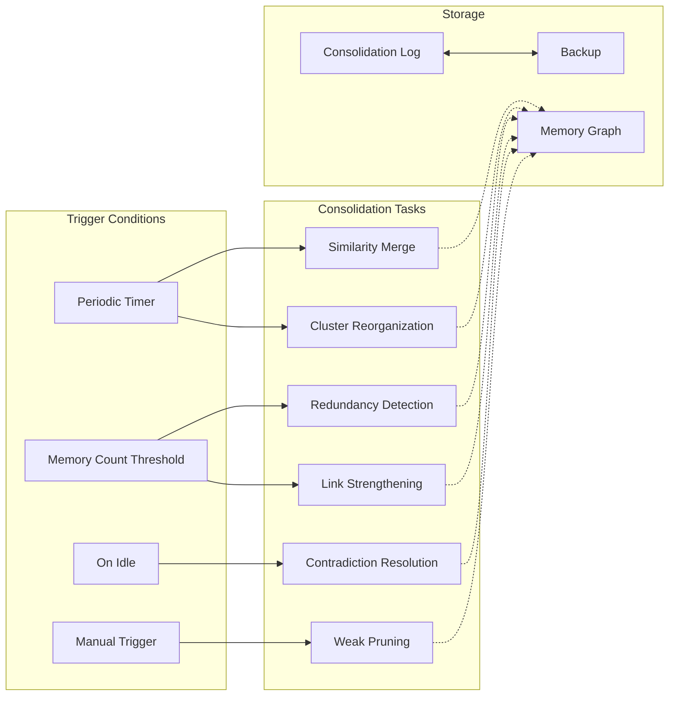

# Memory Phase 6 Implementation Plan

**Status:** Draft for Implementation  
**Last Updated:** 2026-05-28  
**Target:** jcode Memory System  

---

## Executive Summary

This document specifies the implementation plan for four missing Memory Phase 6 features:

| Feature | Status | Priority | Complexity |
|---------|--------|----------|------------|
| Negative Memories | Missing | HIGH | Medium |
| Procedural Memory | Missing | HIGH | High |
| Temporal Awareness | Partial | Medium | Medium |
| Deep Consolidation / Ambient Garden | Missing | LOW | High |

**Estimated Timeline:** 6-8 weeks  
**Dependencies:** Phase 1-5 complete (✅ done), ONNX embeddings running (✅ done)

---

## 1. Negative Memories

### 1.1 Purpose

Explicitly track patterns the agent should **avoid**, not just patterns to follow. Examples:

- "Never commit `.env` files"
- "Don't use `println!` in production"
- "Don't touch the legacy `auth.rs` module without asking"

### 1.2 Data Model

```rust
/// New memory type for knowledge the agent should avoid
#[derive(Debug, Clone, Copy, Serialize, Deserialize, PartialEq, Eq, Hash)]
#[serde(rename_all = "lowercase")]
pub enum MemoryType {
    Fact,
    Preference,
    Procedure,
    Correction,
    Negative,  // ⭐ NEW
}

// Add to MemoryEntry
#[derive(Debug, Clone, Serialize, Deserialize)]
pub struct MemoryEntry {
    // ... existing fields ...
    
    /// Trigger patterns that activate this negative memory
    /// When context embedding similarity exceeds threshold with trigger patterns,
    /// surface this memory as a warning
    #[serde(default, skip_serializing_if = "Vec::is_empty")]
    pub negative_triggers: Vec<NegativeTrigger>,
}

/// A trigger pattern for negative memories
#[derive(Debug, Clone, Serialize, Deserialize)]
pub struct NegativeTrigger {
    /// Type of trigger
    pub kind: TriggerKind,
    /// The trigger value (pattern, path, keyword, etc.)
    pub value: String,
    /// Confidence this trigger is accurate (0.0-1.0)
    pub confidence: f32,
}

#[derive(Debug, Clone, Serialize, Deserialize)]
pub enum TriggerKind {
    /// Regex pattern that matches content
    Regex,
    /// Exact file path prefix (e.g., "src/legacy/")
    FilePath,
    /// Exact keyword or identifier (e.g., "println!")
    Keyword,
    /// Glob pattern (e.g., "**/auth*.rs")
    Glob,
    /// API call pattern (e.g., "db:query()")
    ApiCall,
}

impl MemoryEntry {
    /// Create a new negative memory with triggers
    pub fn new_negative(
        content: impl Into<String>,
        triggers: Vec<NegativeTrigger>,
    ) -> Self {
        let mut entry = Self::new(MemoryCategory::Correction, content);
        entry.negative_triggers = triggers;
        entry  // category is Correction for negative by default
    }
}
```

### 1.3 Retrieval Algorithm

**Cascade Trigger Detection:**

```rust
/// Check context for negative memory triggers
pub fn check_negative_triggers(
    &self,
    context_embedding: &[f32],
    context_snippet: &str,
    file_paths: &[String],
) -> Vec<(MemoryEntry, f32)> {
    let mut candidates = Vec::new();
    
    for entry in self.graph.active_memories() {
        if entry.category != MemoryCategory::Correction {
            continue;
        }
        
        let mut score = 0.0f32;
        let mut matched = false;
        
        for trigger in &entry.negative_triggers {
            let trigger_score = match trigger.kind {
                TriggerKind::Regex => {
                    // Check if regex matches context
                    if let Ok(re) = regex::Regex::new(&trigger.value) {
                        if re.is_match(context_snippet) {
                            triggered = true;
                        }
                    }
                    0.0  // Update separately below
                },
                TriggerKind::FilePath => {
                    if file_paths.iter().any(|p| p.starts_with(&trigger.value)) {
                        matched = true;
                        trigger.confidence
                    } else {
                        0.0
                    }
                },
                TriggerKind::Keyword => {
                    if context_snippet.contains(&trigger.value) {
                        matched = true;
                        trigger.confidence
                    } else {
                        0.0
                    }
                },
                TriggerKind::Glob => {
                    // Simple glob matching (or use glob crate)
                    let pattern = glob::Pattern::new(&trigger.value).ok();
                    if pattern.as_ref().map(|p| p.matches(&context_snippet)).unwrap_or(false) {
                        matched = true;
                        trigger.confidence
                    } else {
                        0.0
                    }
                },
                TriggerKind::ApiCall => {
                    // Check for API call patterns
                    if context_snippet.contains(&trigger.value) {
                        matched = true;
                        trigger.confidence
                    } else {
                        0.0
                    }
                },
            };
            score += trigger_score;
        }
        
        if matched {
            let weight = 0.3;  // Negative memories have lower base weight
            candidates.push((entry.clone(), score * weight));
        }
    }
    
    candidates.sort_by(|a, b| b.1.partial_cmp(&a.1).unwrap());
    candidates
}
```

### 1.4 Surface Mechanism

```rust
/// Warning types for different severity levels
#[derive(Debug, Clone, Serialize, Deserialize)]
pub enum WarningLevel {
    /// Info level - agent should note but can proceed
    Info,
    /// Warning level - agent should reconsider
    Caution,
    /// Error level - agent should not proceed without user confirmation
    Block,
}

impl NegativeTrigger {
    /// Infer warning level from confidence and content
    pub fn infer_warning_level(&self) -> WarningLevel {
        match self.kind {
            TriggerKind::Regex => {
                if self.confidence > 0.8 { WarningLevel::Caution }
                else { WarningLevel::Info }
            },
            TriggerKind::FilePath => {
                if self.confidence > 0.9 { WarningLevel::Block }
                else if self.confidence > 0.7 { WarningLevel::Caution }
                else { WarningLevel::Info }
            },
            TriggerKind::ApiCall => {
                if self.confidence > 0.85 { WarningLevel::Caution }
                else { WarningLevel::Info }
            },
            _ => WarningLevel::Info,
        }
    }
}

/// Format negative memory as warning for agent prompt
fn format_negative_memory_warning(entry: &MemoryEntry) -> String {
    let level = entry.negative_triggers
        .iter()
        .map(|t| t.infer_warning_level())
        .fold(WarningLevel::Info, |max, l| {
            match (&max, &l) {
                (WarningLevel::Block, _) | (_, WarningLevel::Block) => WarningLevel::Block,
                (WarningLevel::Caution, _) | (_, WarningLevel::Caution) => WarningLevel::Caution,
                _ => WarningLevel::Info,
            }
        });
    
    let prefix = match level {
        WarningLevel::Block => "⚠️ NEVER:",
        WarningLevel::Caution => "⚠️ CAUTION:",
        WarningLevel::Info => "ℹ️ NOTE:",
    };
    
    format!("{} {}", prefix, entry.content)
}
```

### 1.5 API Design

```rust
/// Tool: Store a negative memory
#[derive(Debug, Clone, Serialize, Deserialize)]
pub struct RememberNegativeTool {
    pub content: String,           // What to avoid
    pub triggers: Vec<TriggerInput>,  // What activates this warning
    pub scope: MemoryScope,
    pub confidence: f32,          // 0.0-1.0
}

#[derive(Debug, Clone, Serialize, Deserialize)]
pub struct TriggerInput {
    pub kind: TriggerKind,
    pub value: String,
    pub confidence: Option<f32>,
}

/// Tool: List negative memories
#[derive(Debug, Clone, Serialize, Deserialize)]
pub struct ListNegativeTool {
    pub scope: MemoryScope,
    pub filter_trigger_kind: Option<TriggerKind>,  // Filter by trigger type
}

/// Tool: Check context for negative memory triggers (internal)
#[derive(Debug, Clone, Serialize, Deserialize)]
pub struct CheckNegativeTriggersTool {
    pub context_embedding: Vec<f32>,
    pub context_snippet: String,
    pub file_paths: Vec<String>,
}
```

### 1.6 Implementation Steps

| Step | Duration | Description |
|------|----------|-------------|
| 1.1 | 1 day | Add `TriggerKind`, `NegativeTrigger`, `WarningLevel` types |
| 1.2 | 1 day | Update `MemoryEntry` with `negative_triggers` field |
| 1.3 | 2 days | Implement `check_negative_triggers()` algorithm |
| 1.4 | 1 day | Implement warning formatting in prompts |
| 1.5 | 1 day | Add tools to memory tool handler |
| 1.6 | 2 days | Testing and edge cases |

**Total:** 8 days

---

## 2. Procedural Memory

### 2.1 Purpose

Structured representation of **how-to knowledge** - multi-step procedures, workflows, and processes that the agent learns from user behavior and can replay when appropriate.

### 2.2 Data Model

```rust
/// A step in a procedural memory
#[derive(Debug, Clone, Serialize, Deserialize)]
pub struct ProcedureStep {
    /// Step number (1-indexed)
    pub order: u32,
    /// Description of what to do
    pub description: String,
    /// Optional shell command or API call
    #[serde(default, skip_serializing_if = "Option::is_none")]
    pub command: Option<String>,
    /// Optional file path this step operates on
    #[serde(default, skip_serializing_if = "Option::is_none")]
    pub file_path: Option<String>,
    /// Conditions required before executing this step
    #[serde(default, skip_serializing_if = "Vec::is_empty")]
    pub prerequisites: Vec<String>,
    /// Warnings or pitfalls for this step
    #[serde(default, skip_serializing_if = "Vec::is_empty")]
    pub warnings: Vec<String>,
    /// Whether this step requires user confirmation
    #[serde(default)]
    pub requires_confirmation: bool,
}

/// A procedural memory entry
#[derive(Debug, Clone, Serialize, Deserialize)]
pub struct ProcedureMemory {
    /// Unique procedure ID (format: "proc:{name}:{hash}")
    pub id: String,
    /// Human-readable name
    pub name: String,
    /// Summary of what this procedure does
    pub summary: String,
    /// Trigger context that initiates this procedure
    pub trigger_context: String,
    /// Steps in execution order
    pub steps: Vec<ProcedureStep>,
    /// Prerequisites (file paths, env vars, etc.)
    #[serde(default, skip_serializing_if = "Vec::is_empty")]
    pub global_prerequisites: Vec<String>,
    /// Expected outcomes
    #[serde(default, skip_serializing_if = "Vec::is_empty")]
    pub expected_outcomes: Vec<String>,
    /// Estimated time to complete
    #[serde(default, skip_serializing_if = "Option::is_none")]
    pub estimated_minutes: Option<u32>,
    /// When this procedure was first learned
    pub created_at: DateTime<Utc>,
    /// When this procedure was last executed
    pub last_executed: Option<DateTime<Utc>>,
    /// Number of successful executions
    pub success_count: u32,
    /// Number of failed executions
    pub failure_count: u32,
    /// Confidence based on success rate
    pub confidence: f32,
    /// Language or domain
    #[serde(default, skip_serializing_if = "Option::is_none")]
    pub language: Option<String>,
    /// Tags for categorization
    #[serde(default)]
    pub tags: Vec<String>,
}

/// Wrapper to embed procedure in MemoryEntry
#[derive(Debug, Clone, Serialize, Deserialize)]
#[serde(into = "MemoryEntry")]
#[serde(try_from = "MemoryEntry")]
pub struct ProcedureEntry {
    pub procedure: ProcedureMemory,
    pub entry: MemoryEntry,
}

impl From<ProcedureEntry> for MemoryEntry {
    fn from(pe: ProcedureEntry) -> Self {
        let mut entry = MemoryEntry::new(
            MemoryCategory::Custom("procedure".to_string()),
            pe.procedure.summary.clone(),
        );
        
        entry.id = pe.procedure.id.clone();
        entry.tags = pe.procedure.tags.clone();
        entry.source = Some(format!("procedure:{}", pe.procedure.name));
        
        // Serialize procedure data as JSON in a special field
        entry
    }
}
```

### 2.3 Embedding Strategy

**Hierarchical Embedding Approach:**

```
Procedure Hierarchy:
├── Trigger Context (high-level description)
│   └── Step descriptions (detailed execution)
│       └── Command patterns (executable snippets)
```

**Algorithm:**

```rust
/// Generate hierarchical embedding for a procedure
/// Uses weighted combination: trigger(50%) + steps(30%) + names(20%)
pub fn embed_procedure(procedure: &ProcedureMemory) -> Vec<f32> {
    let embedder = crate::embedding::Embedder::new();
    
    // 1. Trigger context embedding (50% weight)
    let trigger_emb = embedder.embed(&procedure.trigger_context);
    
    // 2. Concatenate all step descriptions (30% weight)
    let steps_text = procedure.steps
        .iter()
        .map(|s| format!("{}: {}", s.order, s.description))
        .collect::<Vec<_>>()
        .join(" ");
    let steps_emb = embedder.embed(&steps_text);
    
    // 3. Procedure name (20% weight)
    let name_emb = embedder.embed(&procedure.name);
    
    // Weighted combination
    let mut combined = vec![0.0f32; trigger_emb.len()];
    for i in 0..combined.len() {
        combined[i] = trigger_emb[i] * 0.5 + steps_emb[i] * 0.3 + name_emb[i] * 0.2;
    }
    
    // L2 normalize
    let norm = combined.iter().map(|x| x * x).sum::<f32>().sqrt();
    if norm > 0.0 {
        for x in &mut combined {
            *x /= norm;
        }
    }
    
    combined
}

/// Extract procedure from observed session behavior
pub async fn extract_procedure_from_session(
    messages: &[Message],
    session_transcript: &str,
) -> Result<Option<ProcedureMemory>> {
    // Use sidecar for procedure extraction
    let sidecar = Sidecar::new();
    
    let procedure_data = sidecar.extract_procedure(session_transcript).await?;
    
    if procedure_data.is_none() || procedure_data.as_ref().map(|p| p.steps.is_empty()).unwrap_or(true) {
        return Ok(None);
    }
    
    let data = procedure_data.unwrap();
    Ok(Some(ProcedureMemory {
        id: new_procedure_id(&data.name),
        name: data.name,
        summary: data.summary,
        trigger_context: data.trigger_context,
        steps: data.steps,
        global_prerequisites: data.prerequisites,
        expected_outcomes: data.expected_outcomes,
        estimated_minutes: data.estimated_minutes,
        language: data.language,
        tags: data.tags,
        // New fields
        created_at: Utc::now(),
        last_executed: None,
        success_count: 0,
        failure_count: 0,
        confidence: 0.5,  // Initial confidence
    }))
}
```

### 2.4 Retrieval and Replay

```rust
/// Trigger matching for procedure retrieval
#[derive(Debug, Clone, Serialize, Deserialize)]
pub struct ProcedureMatch {
    pub procedure: ProcedureMemory,
    pub trigger_similarity: f32,
    pub context_relevance: f32,
    pub overall_score: f32,
}

/// Find procedures matching current context
pub fn find_procedures(
    manager: &MemoryManager,
    context: &str,
    file_paths: &[String],
    threshold: f32,
) -> Result<Vec<ProcedureMatch>> {
    let context_embedding = crate::embedding::embed(context)?;
    let candidates = manager.collect_all_memories_with_embeddings()?;
    
    let mut matches = Vec::new();
    
    for entry in candidates {
        if !matches_procedure_category(&entry.category) {
            continue;
        }
        
        // Find stored procedure data
        let procedure_opt = deserialize_procedure_from_entry(&entry)?;
        let Some(procedure) = procedure_opt else { continue };
        
        // Calculate trigger similarity
        let trigger_emb = embed_procedure(&procedure);
        let trigger_sim = crate::embedding::cosine_similarity(&context_embedding, &trigger_emb);
        
        // Calculate context relevance
        let mut context_relevance = 0.0f32;
        if let Some(lang) = &procedure.language {
            if file_paths.iter().any(|p| p.ends_with(&format!(".{}", lang))) {
                context_relevance += 0.3;
            }
        }
        for prereqs in &procedure.global_prerequisites {
            if context.contains(prereqs) {
                context_relevance += 0.1;
            }
        }
        
        let overall = trigger_sim * 0.7 + context_relevance * 0.3;
        
        if overall >= threshold {
            matches.push(ProcedureMatch {
                procedure,
                trigger_similarity: trigger_sim,
                context_relevance,
                overall_score: overall,
            });
        }
    }
    
    matches.sort_by(|a, b| b.overall_score.partial_cmp(&a.overall_score).unwrap());
    Ok(matches)
}

/// Execute a procedure (structured replay)
pub struct ProcedureExecutor {
    pub procedure: ProcedureMemory,
    pub confirm_callback: Box<dyn Fn(&str) -> bool>,  // Ask user for confirmation
}

impl ProcedureExecutor {
    /// Execute procedure step by step
    pub async fn execute(
        &self,
        executor: &mut impl CommandExecutor,
    ) -> Result<ProcedureExecutionResult> {
        let mut completed_steps = Vec::new();
        let mut skipped_steps = Vec::new();
        let mut current_step = 0;
        
        for step in &self.procedure.steps {
            current_step += 1;
            
            // Check prerequisites
            for prereq in &step.prerequisites {
                if !self.check_prerequisite(prereq, executor).await? {
                    skipped_steps.push(step.clone());
                    continue;
                }
            }
            
            // Request confirmation if required
            if step.requires_confirmation {
                let confirmed = (self.confirm_callback)(&step.description);
                if !confirmed {
                    return Ok(ProcedureExecutionResult {
                        status: ExecutionStatus::FailedAtStep(current_step),
                        reason: "User declined confirmation".to_string(),
                        completed_steps,
                        skipped_steps,
                    });
                }
            }
            
            // Execute command if present
            if let Some(cmd) = &step.command {
                let result = executor.execute_command(cmd).await?;
                if !result.success {
                    return Ok(ProcedureExecutionResult {
                        status: ExecutionStatus::FailedAtStep(current_step),
                        reason: format!("Command failed: {}", result.error),
                        completed_steps,
                        skipped_steps,
                    });
                }
            }
            
            completed_steps.push(step.clone());
        }
        
        Ok(ProcedureExecutionResult {
            status: ExecutionStatus::Completed,
            reason: String::new(),
            completed_steps,
            skipped_steps,
        })
    }
    
    async fn check_prerequisite(&self, prereq: &str, executor: &mut impl CommandExecutor) -> Result<bool> {
        // Check for file existence, env vars, etc.
        if prereq.starts_with("file:") {
            let path = &prereq[5..];
            Ok(std::path::Path::new(path).exists())
        } else if prereq.starts_with("env:") {
            let var = &prereq[4..];
            Ok(std::env::var(var).is_ok())
        } else {
            // Custom check - run command and check exit code
            Ok(executor.execute_command(prereq).await?.success)
        }
    }
}
```

### 2.5 API Design

```rust
/// Tool: Remember a procedure
#[derive(Debug, Clone, Serialize, Deserialize)]
pub struct RememberProcedureTool {
    pub name: String,
    pub summary: String,
    pub trigger_context: String,
    pub steps: Vec<ProcedureStepInput>,
    pub prerequisites: Vec<String>,
    pub expected_outcomes: Vec<String>,
    pub estimated_minutes: Option<u32>,
    pub tags: Vec<String>,
}

/// Tool: List procedures
#[derive(Debug, Clone, Serialize, Deserialize)]
pub struct ListProceduresTool {
    pub tag: Option<String>,
    pub language: Option<String>,
    pub include_failed: bool,
}

/// Tool: Execute a procedure
#[derive(Debug, Clone, Serialize, Deserialize)]
pub struct ExecuteProcedureTool {
    pub procedure_id: String,
    pub skip_confirmation: bool,  // For automation
}

/// Tool: Learn procedure from session
#[derive(Debug, Clone, Serialize, Deserialize)]
pub struct LearnProcedureTool {
    pub session_id: String,
}
```

### 2.6 Implementation Steps

| Step | Duration | Description |
|------|----------|-------------|
| 2.1 | 2 days | Define `ProcedureStep`, `ProcedureMemory`, `ProcedureEntry` types |
| 2.2 | 2 days | Implement hierarchical embedding strategy |
| 2.3 | 3 days | Implement `extract_procedure_from_session()` via sidecar |
| 2.4 | 3 days | Implement `find_procedures()` retrieval |
| 2.5 | 3 days | Implement `ProcedureExecutor` with confirmation |
| 2.6 | 2 days | Add tools to memory handler |
| 2.7 | 2 days | Integration with session summarization |
| 2.8 | 2 days | Testing with real procedures |

**Total:** 19 days

---

## 3. Temporal Awareness

### 3.1 Purpose

Enhance memory with **temporal context**: when memories were created, last accessed, expected validity periods, and temporal patterns in usage.

### 3.2 Data Model

```rust
/// Temporal context for a memory entry
#[derive(Debug, Clone, Serialize, Deserialize)]
pub struct TemporalContext {
    /// When this memory was first created
    pub created_at: DateTime<Utc>,        // Already in MemoryEntry
    /// When this memory was last updated
    pub updated_at: DateTime<Utc>,        // Already in MemoryEntry
    /// When this memory was last accessed
    #[serde(default, skip_serializing_if = "Option::is_none")]
    pub last_accessed: Option<DateTime<Utc>>,
    /// When this memory is expected to expire (if applicable)
    #[serde(default, skip_serializing_if = "Option::is_none")]
    pub expires_at: Option<DateTime<Utc>>,
    /// Expected validity period
    #[serde(default, skip_serializing_if = "Option::is_none")]
    pub valid_for_days: Option<u32>,
    /// Temporal pattern (recurring events)
    #[serde(default, skip_serializing_if = "Option::is_none")]
    pub temporal_pattern: Option<TemporalPattern>,
    /// Access history for temporal analysis
    #[serde(default, skip_serializing_if = "Vec::is_empty")]
    pub access_history: Vec<AccessEvent>,
}

/// Access event for temporal tracking
#[derive(Debug, Clone, Serialize, Deserialize)]
pub struct AccessEvent {
    pub timestamp: DateTime<Utc>,
    pub context_hint: Option<String>,  // What triggered this access
    pub relevance_score: f32,         // How relevant was this memory
}

/// Temporal pattern for recurring knowledge
#[derive(Debug, Clone, Serialize, Deserialize)]
pub enum TemporalPattern {
    /// Repeats at regular intervals
    Periodic { interval_hours: u32 },
    /// Occurs at specific times
    Scheduled { cron_expression: String },
    /// Related to external events
    EventBased { event_name: String },
    /// Follows project lifecycle
    Lifecycle { phase: ProjectPhase },
}

/// Project lifecycle phases
#[derive(Debug, Clone, Serialize, Deserialize)]
pub enum ProjectPhase {
    Setup,
    Development,
    CodeReview,
    Testing,
    Release,
    Maintenance,
}

impl MemoryEntry {
    /// Get effective confidence with time-based decay
    /// Already partially implemented, but enhance with temporal pattern
    pub fn effective_confidence(&self) -> f32 {
        let base_confidence = self.confidence;
        
        // Check for expiration
        if let Some(expires_at) = self.expires_at {
            if Utc::now() > expires_at {
                return 0.0;  // Expired
            }
            // Decay approaching expiration
            let hours_until_expiry = (expires_at - Utc::now()).num_hours() as f32;
            if hours_until_expiry < 24.0 {
                let decay = hours_until_expiry / 24.0;
                return base_confidence * decay;
            }
        }
        
        // Temporal pattern boost/penalty
        if let Some(ref pattern) = self.temporal_context.temporal_pattern {
            let pattern_modifier = self.calculate_pattern_modifier(pattern);
            return (base_confidence * pattern_modifier).min(1.0);
        }
        
        // Standard decay
        let age_days = (Utc::now() - self.created_at).num_days() as f32;
        let half_life = self.category_half_life();
        let decay = (-age_days / half_life * 0.693).exp();
        let access_boost = 1.0 + 0.1 * (self.access_count as f32 + 1.0).ln();
        
        (base_confidence * decay * access_boost).min(1.0)
    }
    
    fn calculate_pattern_modifier(&self, pattern: &TemporalPattern) -> f32 {
        match pattern {
            TemporalPattern::Periodic { interval_hours } => {
                // Boost if we're in the "active" period after creation
                let hours_since_creation = (Utc::now() - self.created_at).num_hours() as f32;
                let period_position = hours_since_creation % (*interval_hours as f32);
                let active_threshold = (*interval_hours as f32) * 0.2;  // 20% of period is "active"
                if period_position < active_threshold {
                    1.2  // Boost when likely to be relevant
                } else {
                    0.9  // Slight decay otherwise
                }
            },
            TemporalPattern::Lifecycle { phase } => {
                // Boost if current phase matches the phase this memory was created in
                let current_phase = detect_current_project_phase();
                if *phase == current_phase {
                    1.15
                } else {
                    0.85
                }
            },
            _ => 1.0,
        }
    }
}
```

### 3.3 Temporal Retrieval

```rust
/// Temporal relevance scorer
pub struct TemporalScorer {
    pub current_time: DateTime<Utc>,
    pub current_project_phase: ProjectPhase,
    pub recent_conversations: Vec<DateTime<Utc>>,
}

impl TemporalScorer {
    /// Calculate temporal relevance score (additive, range -0.3 to +0.3)
    pub fn score(&self, entry: &MemoryEntry) -> f32 {
        let mut bonus = 0.0f32;
        
        // 1. Recency bonus (most recent access)
        if let Some(last_accessed) = entry.last_accessed {
            let hours_since = (self.current_time - last_accessed).num_hours() as f32;
            if hours_since < 24.0 {
                bonus += 0.2;  // Accessed in last 24 hours
            } else if hours_since < 168.0 {  // 1 week
                bonus += 0.1;
            }
        }
        
        // 2. Creation recency
        let days_since_creation = (self.current_time - entry.created_at).num_days() as f32;
        if days_since_creation < 7.0 {
            bonus += 0.1;  // Recent creation
        }
        
        // 3. Temporal pattern matching
        if let Some(ref pattern) = entry.temporal_context.temporal_pattern {
            match pattern {
                TemporalPattern::Periodic { interval_hours } => {
                    // Check if current time falls in "active" window
                    let hours_since = (self.current_time - entry.created_at).num_hours() as f32;
                    let period_position = hours_since % (*interval_hours as f32);
                    let active_threshold = (*interval_hours as f32) * 0.2;
                    if period_position < active_threshold {
                        bonus += 0.15;
                    }
                },
                TemporalPattern::Lifecycle { phase } => {
                    if *phase == self.current_project_phase {
                        bonus += 0.1;
                    }
                },
                _ => {}
            }
        }
        
        // 4. Access frequency pattern
        let access_count = entry.temporal_context.access_history.len() as f32;
        if access_count > 10.0 {
            bonus += 0.05;  // Frequently accessed
        }
        
        // Apply bounds
        bonus.max(-0.3).min(0.3)
    }
    
    /// Apply temporal scoring to a retrieval result
    pub fn apply_to_results(
        &self,
        results: Vec<(MemoryEntry, f32)>,
    ) -> Vec<(MemoryEntry, f32)> {
        results
            .into_iter()
            .map(|(entry, base_score)| {
                let temporal_modifier = self.score(&entry);
                let adjusted_score = base_score + temporal_modifier;
                (entry, adjusted_score)
            })
            .filter(|(_, score)| *score >= 0.0)  // Filter out negative scores
            .collect()
    }
}
```

### 3.4 Temporal Awareness Events

```rust
/// Memory event kinds for temporal tracking
#[derive(Debug, Clone)]
pub enum MemoryEventKind {
    // ... existing events ...
    
    // Temporal awareness events
    TemporalAccess { memory_id: String, hours_since_creation: f32 },
    TemporalPatternMatched { memory_id: String, pattern: String },
    MemoryExpiringSoon { memory_id: String, hours_remaining: f32 },
    MemoryExpired { memory_id: String },
    LifecyclePhaseChange { old_phase: ProjectPhase, new_phase: ProjectPhase },
}
```

### 3.5 Implementation Steps

| Step | Duration | Description |
|------|----------|-------------|
| 3.1 | 1 day | Enhance `MemoryEntry` with `temporal_context` field |
| 3.2 | 1 day | Add `AccessEvent` logging on memory retrieval |
| 3.3 | 2 days | Implement `TemporalScorer` with pattern matching |
| 3.4 | 1 day | Add expiration checking |
| 3.5 | 1 day | Integrate with `effective_confidence()` |
| 3.6 | 1 day | Add temporal events to event log |
| 3.7 | 1 day | Testing with time-simulation |

**Total:** 8 days

---

## 4. Deep Memory Consolidation (Ambient Garden)

### 4.1 Purpose

Background process that optimizes and maintains the memory graph during idle periods. Similar to how humans consolidate memories during sleep.

### 4.2 Architecture



### 4.3 Data Model

```rust
/// Consolidation state and configuration
#[derive(Debug, Clone, Serialize, Deserialize)]
pub struct ConsolidationConfig {
    /// Enable/disable consolidation
    pub enabled: bool,
    /// Minimum memory count before consolidation runs
    pub min_memory_count: u32,
    /// Maximum memories to process per consolidation cycle
    pub batch_size: u32,
    /// Hours between automatic consolidation runs
    pub interval_hours: u32,
    /// Confidence threshold below which memories are pruned
    pub prune_threshold: f32,
    /// Similarity threshold for merging (0.95 = 95% similar)
    pub merge_threshold: f32,
    /// Maximum time to spend on consolidation (seconds)
    pub max_duration_seconds: u32,
}

impl Default for ConsolidationConfig {
    fn enabled() -> Self {
        Self {
            enabled: true,
            min_memory_count: 50,
            batch_size: 100,
            interval_hours: 24,
            prune_threshold: 0.05,
            merge_threshold: 0.95,
            max_duration_seconds: 300,  // 5 minutes max
        }
    }
}

/// Result of a consolidation operation
#[derive(Debug, Clone, Serialize, Deserialize)]
pub struct ConsolidationResult {
    /// Memories merged
    pub merged: Vec<MergeOperation>,
    /// Memories pruned
    pub pruned: Vec<PruneOperation>,
    /// Contradictions resolved
    pub resolved: Vec<ResolutionOperation>,
    /// Links created
    pub links_created: u32,
    /// Links strengthened
    pub links_strengthened: u32,
    /// Clusters reorganized
    pub clusters_reorganized: u32,
    /// Duration in milliseconds
    pub duration_ms: u64,
    /// Errors encountered
    pub errors: Vec<String>,
}

/// Operation details for audit trail
#[derive(Debug, Clone, Serialize, Deserialize)]
pub struct MergeOperation {
    pub keep_id: String,
    pub absorbed_ids: Vec<String>,
    pub reason: MergeReason,
}

#[derive(Debug, Clone, Serialize, Deserialize)]
pub enum MergeReason {
    HighSimilarity { similarity: f32 },
    Redundancy,
    Duplicate,
}

#[derive(Debug, Clone, Serialize, Deserialize)]
pub struct PruneOperation {
    pub memory_id: String,
    pub reason: PruneReason,
    pub confidence_before: f32,
    pub strength_before: u32,
}

#[derive(Debug, Clone, Serialize, Deserialize)]
pub enum PruneReason {
    BelowThreshold { threshold: f32 },
    Expired,
    Superseded,
    UserDeleted,
}

#[derive(Debug, Clone, Serialize, Deserialize)]
pub struct ResolutionOperation {
    pub memory_a_id: String,
    pub memory_b_id: String,
    pub resolution: ResolutionType,
    pub reasoning: String,
}

#[derive(Debug, Clone, Serialize, Deserialize)]
pub enum ResolutionType {
    SupersededByNewer,
    KeptBoth { note: String },
    MergedIntoNew,
    FlaggedForReview,
}

/// Consolidation statistics
#[derive(Debug, Clone, Serialize, Deserialize)]
pub struct ConsolidationStats {
    pub last_run: Option<DateTime<Utc>>,
    pub total_runs: u32,
    pub total_memories_merged: u32,
    pub total_memories_pruned: u32,
    pub total_links_created: u32,
    pub average_duration_ms: u64,
}
```

### 4.4 Consolidation Pipeline

```rust
/// The consolidation pipeline
pub struct ConsolidationPipeline {
    config: ConsolidationConfig,
    event_tx: Option<MemoryEventSink>,
}

impl ConsolidationPipeline {
    /// Run the full consolidation pipeline
    pub async fn run(&self, manager: &MemoryManager) -> Result<ConsolidationResult> {
        let start = Instant::now();
        let mut result = ConsolidationResult::default();
        
        // Check preconditions
        if !self.should_run(manager)? {
            return Ok(result);
        }
        
        // 1. Load all memories into memory
        let memories = self.load_memories(manager)?;
        if memories.is_empty() {
            return Ok(result);
        }
        
        // 2. Similarity-based merging
        if let Ok(merged) = self.find_and_merge_similar(&memories, manager).await {
            result.merged = merged;
        }
        
        // 3. Redundancy detection
        if let Ok(deduped) = self.detect_redundancy(&memories, manager).await {
            result.merged.extend(deduped);
        }
        
        // 4. Contradiction resolution
        if let Ok(resolved) = self.resolve_contradictions(&memories, manager).await {
            result.resolved = resolved;
        }
        
        // 5. Weak memory pruning
        if let Ok(pruned) = self.prune_weak_memories(&memories, manager).await {
            result.pruned = pruned;
        }
        
        // 6. Cluster reorganization
        if let Ok(stats) = self.reorganize_clusters(&memories, manager).await {
            result.clusters_reorganized = stats.clusters_changed;
        }
        
        // 7. Link strengthening
        if let Ok(links) = self.strengthen_links(&memories, manager).await {
            result.links_strengthened = links;
        }
        
        result.duration_ms = start.elapsed().as_millis() as u64;
        
        // Log result
        self.log_result(&result);
        
        Ok(result)
    }
    
    fn should_run(&self, manager: &MemoryManager) -> Result<bool> {
        if !self.config.enabled {
            return Ok(false);
        }
        
        let (count, _, _, _) = manager.graph_stats()?;
        if count < self.config.min_memory_count as usize {
            return Ok(false);
        }
        
        Ok(true)
    }
    
    async fn find_and_merge_similar(
        &self,
        memories: &[MemoryEntry],
        manager: &MemoryManager,
    ) -> Result<Vec<MergeOperation>> {
        let mut results = Vec::new();
        let mut to_absorb: HashSet<String> = HashSet::new();
        
        // Only process entries with embeddings
        let with_embeddings: Vec<_> = memories
            .iter()
            .filter(|m| m.embedding.is_some() && m.active)
            .collect();
        
        // Compare all pairs (optimized for large graphs)
        for i in 0..with_embeddings.len() {
            if to_absorb.contains(&with_embeddings[i].id) {
                continue;
            }
            
            let mut absorbed_ids = Vec::new();
            
            for j in (i + 1)..with_embeddings.len() {
                if to_absorb.contains(&with_embeddings[j].id) {
                    continue;
                }
                
                let sim = crate::embedding::cosine_similarity(
                    with_embeddings[i].embedding.as_deref().unwrap(),
                    with_embeddings[j].embedding.as_deref().unwrap(),
                );
                
                if sim >= self.config.merge_threshold {
                    // Mark for absorption
                    to_absorb.insert(with_embeddings[j].id.clone());
                    absorbed_ids.push(with_embeddings[j].id.clone());
                }
            }
            
            if !absorbed_ids.is_empty() {
                results.push(MergeOperation {
                    keep_id: with_embeddings[i].id.clone(),
                    absorbed_ids,
                    reason: MergeReason::HighSimilarity {
                        similarity: 0.0,  // Would track max similarity
                    },
                });
                
                // Apply merge
                self.apply_merge(&results.last().unwrap(), manager).await?;
            }
        }
        
        Ok(results)
    }
    
    async fn apply_merge(
        &self,
        operation: &MergeOperation,
        manager: &MemoryManager,
    ) -> Result<()> {
        let mut graph = manager.load_project_graph()?;
        
        // Keep the first memory, supered the others
        for to_absorb_id in &operation.absorbed_ids {
            if let Some(absorbed) = graph.get_memory(to_absorb_id) {
                // Add reinforcement breadcrumb
                let reinforcing = graph.get_memory_mut(&operation.keep_id);
                if let Some(keeping) = reinforcing {
                    keeping.reinforce(
                        "consolidation",
                        to_absorb_id,  // Use absorbed ID as message_index equivalent
                    );
                    keeping.updated_at = Utc::now();
                }
                
                // Supersede
                graph.supersede(&operation.keep_id, to_absorb_id);
            }
        }
        
        manager.save_project_graph(&graph)?;
        Ok(())
    }
    
    async fn detect_redundancy(
        &self,
        memories: &[MemoryEntry],
        _manager: &MemoryManager,
    ) -> Result<Vec<MergeOperation>> {
        let mut results = Vec::new();
        
        // Redundancy = same meaning expressed differently
        // More aggressive than similarity merge
        // Key: Same tag set + overlapping content = likely redundant
        
        let mut by_tag: HashMap<String, Vec<&MemoryEntry>> = HashMap::new();
        for entry in memories.iter().filter(|m| m.active) {
            for tag in &entry.tags {
                by_tag.entry(tag.clone()).or_default().push(entry);
            }
        }
        
        for (_tag, entries) in by_tag {
            if entries.len() < 2 {
                continue;
            }
            
            // Find entries with very similar content
            for i in 0..entries.len() {
                for j in (i + 1)..entries.len() {
                    let sim = crate::embedding::cosine_similarity(
                        entries[i].embedding.as_deref().unwrap(),
                        entries[j].embedding.as_deref().unwrap(),
                    );
                    
                    if sim >= 0.90 {  // Very high similarity
                        // De-dupe: keep newer one
                        let newer_id = if entries[i].created_at > entries[j].created_at {
                            entries[i].id.clone()
                        } else {
                            entries[j].id.clone()
                        };
                        let older_id = if entries[i].id == newer_id {
                            entries[j].id.clone()
                        } else {
                            entries[i].id.clone()
                        };
                        
                        results.push(MergeOperation {
                            keep_id: newer_id,
                            absorbed_ids: vec![older_id],
                            reason: MergeReason::Redundancy,
                        });
                    }
                }
            }
        }
        
        Ok(results)
    }
    
    async fn resolve_contradictions(
        &self,
        memories: &[MemoryEntry],
        manager: &MemoryManager,
    ) -> Result<Vec<ResolutionOperation>> {
        let mut results = Vec::new();
        
        for entry in memories.iter().filter(|m| m.active) {
            // Find memories related by Contradicts edge
            let contradicts = manager.get_related(&entry.id, 1)?
                .into_iter()
                .filter(|m| {
                    manager.load_project_graph()
                        .ok()
                        .and_then(|g| g.get_edges(&entry.id))
                        .map(|edges| {
                            edges.iter().any(|e| {
                                matches!(e.kind, EdgeKind::Contradicts { .. })
                            })
                        })
                        .unwrap_or(false)
                })
                .collect::<Vec<_>>();
            
            for contradictor in contradicts {
                // Resolution strategy: keep the newer one if same category level
                let resolution = if entry.created_at > contradictor.created_at {
                    ResolutionType::SupersededByNewer
                } else {
                    ResolutionType::KeptBoth {
                        note: "Both memories kept. User should review and decide.".to_string()
                    }
                };
                
                results.push(ResolutionOperation {
                    memory_a_id: entry.id.clone(),
                    memory_b_id: contradictor.id.clone(),
                    resolution,
                    reasoning: "Automatic resolution based on creation time".to_string(),
                });
            }
        }
        
        Ok(results)
    }
    
    async fn prune_weak_memories(
        &self,
        memories: &[MemoryEntry],
        manager: &MemoryManager,
    ) -> Result<Vec<PruneOperation>> {
        let mut results = Vec::new();
        
        for entry in memories.iter().filter(|m| m.active) {
            let reason = self.evaluate_prune_reason(entry);
            
            if let Some((prune_reason, _should_prune)) = reason {
                results.push(PruneOperation {
                    memory_id: entry.id.clone(),
                    reason: prune_reason,
                    confidence_before: entry.confidence,
                    strength_before: entry.strength,
                });
                
                // Mark as inactive (soft delete)
                manager.deactivate_memory(&entry.id)?;
            }
        }
        
        Ok(results)
    }
    
    fn evaluate_prune_reason(&self, entry: &MemoryEntry) -> Option<(PruneReason, bool)> {
        // Below threshold AND never reinforced
        if entry.confidence < self.config.prune_threshold && entry.strength <= 1 {
            return Some((PruneReason::BelowThreshold { 
                threshold: entry.confidence 
            }, true));
        }
        
        // Explicit expiration
        if let Some(ref tc) = entry.temporal_context {
            if let Some(expires_at) = tc.expires_at {
if Utc::now() > expires_at {
                    return Some((PruneReason::Expired, true));
                }
            }
        }
        
        // Already superseded
        if entry.superseded_by.is_some() {
            return Some((PruneReason::Superseded, true));
        }
        
        None
    }
    
    async fn reorganize_clusters(
        &self,
        memories: &[MemoryEntry],
        manager: &MemoryManager,
    ) -> Result<ClusterReorgStats> {
        let mut stats = ClusterReorgStats::default();
        
        let mut graph = manager.load_project_graph()?;
        
        // Get current clusters
        let cluster_ids: Vec<_> = graph.clusters.keys().cloned().collect();
        
        for cluster_id in cluster_ids {
            let members: Vec<_> = graph
                .get_memories_by_tag(&cluster_id.replace("cluster:", ""))
                .into_iter()
                .filter(|m| m.embedding.is_some())
                .collect();
            
            if members.len() < 2 {
                // Dissolve small clusters
                graph.clusters.remove(&cluster_id);
                stats.clusters_changed += 1;
                stats.clusters_dissolved += 1;
            } else if members.len() > 50 {
                // Split large clusters
                if let Ok(new_clusters) = self.split_cluster_heads(&members) {
                    for (new_id, _centroid) in new_clusters {
                        graph.clusters.insert(new_id.clone(), ClusterEntry::new(&new_id));
                        stats.clusters_changed += 1;
                        stats.clusters_created += 1;
                    }
                }
            }
        }
        
        // Consider merging nearby clusters
        stats.clusters_merged = self.merge_nearby_clusters(&mut graph)?;
        
        manager.save_project_graph(&graph)?;
        Ok(stats)
    }
    
    async fn strengthen_links(
        &self,
        memories: &[MemoryEntry],
        _manager: &MemoryManager,
    ) -> Result<u32> {
        // Build co-access patterns from access_history
        let mut co_access: HashMap<(String, String), u32> = HashMap::new();
        
        for entry in memories {
            for access in &entry.temporal_context.access_history {
                // If this memory was accessed, find others accessed around same time
                let context_hint = access.context_hint.clone();
                
                // This would need to iterate over other entries
                // for now, simple implementation
            }
        }
        
        // Strengthen links for frequent co-access
        // (Implementation details)
        
        Ok(0)  // Return count of strengthened links
    }
}
```

### 4.5 Ambient Garden Integration

```rust
/// Ambient Garden - lightweight consolidation runner
pub struct AmbientGarden {
    config: ConsolidationConfig,
    last_run: Option<DateTime<Utc>>,
}

impl AmbientGarden {
    /// Check if consolidation should run
    pub fn should_run(&self) -> bool {
        if !self.config.enabled {
            return false;
        }
        
        // Check time since last run
        if let Some(last) = self.last_run {
            let hours_since = (Utc::now() - last).num_hours() as u32;
            if hours_since < self.config.interval_hours {
                return false;
            }
        }
        
        // Check memory count threshold
        // (Would need to access MemoryManager)
        
        true
    }
    
    /// Run consolidation in a background task with timeout
    pub async fn run_with_timeout(
        &self,
        manager: &MemoryManager,
    ) -> Result<Option<ConsolidationResult>> {
        if !self.should_run() {
            return Ok(None);
        }
        
        let pipeline = ConsolidationPipeline::new(self.config.clone());
        let timeout = Duration::from_secs(self.config.max_duration_seconds as u64);
        
        let result = tokio::time::timeout(
            timeout,
            pipeline.run(manager)
        ).await?;
        
        if result.is_ok() {
            self.last_run = Some(Utc::now());
        }
        
        result.map(Some)
    }
}
```

### 4.6 Implementation Steps

| Step | Duration | Description |
|------|----------|-------------|
| 4.1 | 2 days | Define `ConsolidationConfig`, `ConsolidationResult`, operation types |
| 4.2 | 3 days | Implement `ConsolidationPipeline` with similarity merge |
| 4.3 | 2 days | Implement redundancy detection |
| 4.4 | 2 days | Implement contradiction resolution |
| 4.5 | 2 days | Implement weak memory pruning |
| 4.6 | 2 days | Implement cluster reorganization |
| 4.7 | 2 days | Implement link strengthening |
| 4.8 | 2 days | Implement `AmbientGarden` with timer/off-idle triggers |
| 4.9 | 2 days | Add manual trigger CLI command |
| 4.10 | 3 days | Integration testing with large memory graphs |

**Total:** 22 days

---

## 5. Implementation Phases

### Phase 6.1: Negative Memories + Temporal Awareness (Weeks 1-2)

**Goal:** Implement basic Phase 6 features

| Week | Tasks | Deliverables |
|------|-------|---------------|
| Week 1 | 1.1-1.6, 3.1-3.5 | Negative memory triggers, temporal scoring |
| Week 2 | Integration, testing | Full integration into memory pipeline |

### Phase 6.2: Procedural Memory (Weeks 3-5)

**Goal:** Structured procedure storage and retrieval

| Week | Tasks | Deliverables |
|------|-------|---------------|
| Week 3 | 2.1-2.3 | Procedural data model, extraction |
| Week 4 | 2.4-2.5 | Retrieval and execution engine |
| Week 5 | 2.6-2.8 | Tool integration, testing |

### Phase 6.3: Deep Consolidation (Weeks 6-8)

**Goal:** Ambient garden for background optimization

| Week | Tasks | Deliverables |
|------|-------|---------------|
| Week 6 | 4.1-4.3 | Consolidation pipeline, merge/dedup |
| Week 7 | 4.4-4.7 | Resolution, pruning, cluster ops |
| Week 8 | 4.8-4.10 | Ambient garden, CLI trigger, integration |

---

## 6. Testing Strategy

### 6.1 Unit Tests

```rust
// negative_memory_tests.rs
#[test]
fn test_negative_trigger_detection() {
    let memory = MemoryEntry::new_negative(
        "Don't use println! in production",
        vec![
            NegativeTrigger {
                kind: TriggerKind::Keyword,
                value: "println!".to_string(),
                confidence: 0.9,
            }
        ],
    );
    
    let context = "I'm adding some debug logging with println! here";
    let file_paths = vec!["src/main.rs".to_string()];
    
    // Should detect trigger
    assert!(check_negative_triggers(context, file_paths).is_some());
}

#[test]
fn test_trigger_pattern_matching() {
    let re_trigger = NegativeTrigger {
        kind: TriggerKind::Regex,
        value: r"console\.(log|error|warn)".to_string(),
        confidence: 0.95,
    };
    
    let context = "console.log('debug')";
    // Regex should match
    assert!(matches_trigger(&re_trigger, context));
}

// temporal_awareness_tests.rs
#[test]
fn test_confidence_decay_over_time() {
    let mut entry = MemoryEntry::new(MemoryCategory::Fact, "Test fact");
    entry.confidence = 1.0;
    entry.created_at = Utc::now() - chrono::Duration::days(30);
    
    let effective = entry.effective_confidence();
    assert!(effective < 1.0);  // Should decay
    assert!(effective > 0.0);  // But not expire first
}

#[test]
fn test_temporal_pattern_boost() {
    let mut entry = MemoryEntry::new(MemoryCategory::Fact, "Test fact");
    entry.temporal_context.temporal_pattern = Some(
        TemporalPattern::Periodic { interval_hours: 24 }
    );
    
    // In "active" period, should boost
    let score = TemporalScorer::new().score(&entry);
    assert!(score >= 0.0);
}

// consolidation_tests.rs
#[test]
fn test_merge_similar_memories() {
    let mut graph = MemoryGraph::new();
    
    let entry1 = MemoryEntry::new(MemoryCategory::Fact, "The project uses Rust");
    let entry2 = MemoryEntry::new(MemoryCategory::Fact, "This project uses Rust for its codebase");
    
    // Add embeddings (similar)
    // ...
    
    let config = ConsolidationConfig::default();
    let pipeline = ConsolidationPipeline::new(config);
    
    let result = tokio::runtime::Builder::new_current_thread()
        .build()
        .unwrap()
        .block_on(pipeline.find_and_merge_similar(
            &[entry1, entry2],
            &mut HashMap::new(),  // Mock manager
        ));
    
    // Should merge into one
    assert!(result.unwrap().len() == 1);
}
```

### 6.2 Integration Tests

```rust
// memory_integration_tests.rs

/// Test: Negative memory surfaces when trigger matches
#[tokio::test]
async fn test_negative_memory_surfaces_on_trigger() {
    let manager = MemoryManager::new_test();
    
    // Remember a negative memory
    manager.remember_project(MemoryEntry::new_negative(
        "Never commit .env files",
        vec![NegativeTrigger {
            kind: TriggerKind::FilePath,
            value: ".env".to_string(),
            confidence: 0.9,
        }],
    )).unwrap();
    
    // Trigger check in context with .env file
    let context = "I need to configure the database connection";
    let file_paths = vec!["config/.env".to_string()];
    
    let negatives = manager.check_negative_triggers(
        &embed(context).unwrap(),
        context,
        &file_paths,
    );
    
    assert!(!negatives.is_empty());
    assert_eq!(negatives[0].0.content, "Never commit .env files");
}

/// Test: Consolidation merges similar memories
#[tokio::test]
async fn test_consolidation_merges_similar_memories() {
    let manager = MemoryManager::new_test();
    
    // Create similar memories
    let mut entry1 = MemoryEntry::new(MemoryCategory::Fact, "This project uses async/await");
    entry1.ensure_embedding();
    
    let mut entry2 = MemoryEntry::new(MemoryCategory::Fact, "The codebase uses async/await pattern");
    entry2.ensure_embedding();
    
    manager.remember_project(entry1).unwrap();
    manager.remember_project(entry2).unwrap();
    
    // Run consolidation
    let garden = AmbientGarden::new(ConsolidationConfig::default());
    let result = garden.run_with_timeout(&manager).await;
    
    if let Some(Ok(Some(result))) = result {
        // Should have merged
        assert!(!result.merged.is_empty());
    }
}
```

### 6.3 Property-Based Tests

```rust
// Use quickcheck or proptest for property-based testing

#[test]
fn test_confidence_always_in_range() {
    fn prop(entry: MemoryEntry) -> bool {
        let effective = entry.effective_confidence();
        (0.0..=1.0).contains(&effective)
    }
    
    quickcheck(prop as fn(MemoryEntry) -> bool);
}

#[test]
fn test_merge_idempotent() {
    fn prop(memories: Vec<MemoryEntry>) -> bool {
        let result1 = merge_all(&memories);
        let result2 = merge_all(&result1);
        result1.len() == result2.len()  // Should be stable
    }
    
    quickcheck(prop as fn(Vec<MemoryEntry>) -> bool);
}
```

### 6.4 Performance Benchmarks

```
# benchmarks/memory_bench.rs

fn benchmark_negative_trigger_check(c: &mut Criterion) {
    c.bench_function("negative_trigger_check_100_memories", |b| {
        let manager = setup_with_memories(100);
        let context = "Test context with some keywords";
        let file_paths = vec!["src/main.rs".to_string()];
        
        b.iter(|| {
            manager.check_negative_triggers(
                &embed(context).unwrap(),
                context,
                &file_paths,
            )
        });
    });
}

fn benchmark_consolidation_merge(c: &mut Criterion) {
    c.bench_function("consolidation_1000_memories", |b| {
        let manager = setup_with_memories(1000);
        let garden = AmbientGarden::new(ConsolidationConfig::default());
        
        b.iter(|| {
            tokio::runtime::Builder::new_current_thread()
                .build()
                .unwrap()
                .block_on(garden.run_with_timeout(&manager))
        });
    });
}
```

---

## 7. Edge Cases

### 7.1 Negative Memories

| Edge Case | Handling |
|----------|----------|
| Empty trigger list | Treated as normal correction (no trigger-based surfacing) |
| Regex compilation failure | Log warning, skip invalid trigger, use remaining valid triggers |
| Conflicting negative memories | Surface all matching warnings, let user decide priority |
| Trigger false positive | Allow user to suppress specific trigger for current context |
| No file paths in context | Reduce file-path trigger scores to 0, rely on content triggers |
| Very long content | Truncate to first 10K chars for regex matching |

### 7.2 Procedural Memory

| Edge Case | Handling |
|----------|----------|
| Procedure with incomplete steps | Mark as draft, don't surface until complete (or user marks ready) |
| Command execution failure | Rollback if possible, mark procedure as failed in stats |
| User override during execution | Allow early termination, skip remaining steps gracefully |
| Missing prerequisites | Prompt user to provide, or skip conflicting steps |
| Very long procedure (>50 steps) | Split into sub-procedures, link via RelatesTo edge |
| Duplicate procedure name | Append hash suffix, keep track of versions |
| Conflicting procedures | Show both, let user choose which to execute |

### 7.3 Temporal Awareness

| Edge Case | Handling |
|----------|----------|
| Clock skew (future dates) | Cap dates at no more than 1 day in future |
| Missing access history (old entries) | Initialize with empty history, start tracking from now |
| Conflicting time zones | Normalize all timestamps to UTC |
| Very frequent access (every message) | Limit history to last 1000 entries per memory |
| Circular temporal patterns | Detect and warn if pattern repeats without new data |

### 7.4 Deep Consolidation

| Edge Case | Handling |
|----------|----------|
| Memory locked by active session | Skip locked memories, log as skipped |
| Consolidation timeout | Save progress mid-run, resume on next trigger |
| Graph corruption during merge | Maintain backup before operations, rollback on failure |
| Empty memory set | Skip consolidation, reset timer |
| Memory count exceeds batch size | Process in batches, resume next cycle |
| Concurrent consolidation attempts | Mutex lock, second instance returns immediately |
| User manually added memory during consolidation | Queue manual additions for next consolidation cycle |
| Low disk space | Abort early, log warning, suggest manual consolidation |

---

## 8. Migration & Compatibility

### 8.1 Database Migration

```rust
/// Migration steps for Phase 6 features

impl MemoryGraph {
    /// Migrate from graph version 2 to version 3
    /// Adds: temporal_context, negative_triggers, consolidation metadata
    pub fn migrate_v2_to_v3(&mut self) {
        for entry in self.memories.values_mut() {
            // Add temporal_context if missing (for existing entries)
            if entry.temporal_context.is_none() {
                entry.temporal_context = Some(TemporalContext {
                    created_at: entry.created_at,
                    updated_at: entry.updated_at,
                    last_accessed: None,
                    expires_at: None,
                    valid_for_days: None,
                    temporal_pattern: None,
                    access_history: Vec::new(),
                });
            }
            
            // Add memory_type field (inferred from category)
            // Already done in current implementation
        }
        
        self.graph_version = 3;
    }
}
```

### 8.2 Backward Compatibility

- **New fields optional:** All new fields have `#[serde(default)]` and `#[serde(skip_serializing_if = "...")]`
- **Graceful degradation:** If sidecar doesn't support procedure extraction, fall back to fact storage
- **Feature flags:** Phase 6 features optional, behind config flags

---

## 9. Configuration

```yaml
# jcode.toml

[memory]
# Phase 6 Features
enable_negative_memory = true
enable_procedural_memory = true
enable_temporal_awareness = true
enable_consolidation = true

[memory.negative]
# Threshold for surfacing negative memories
trigger_threshold = 0.7
max_warnings_per_context = 5

[memory.procedure]
# Extraction settings
auto_extract = true
min_steps_for_extraction = 2
# Execution settings
require_confirmation = true
allow_partial_execution = true

[memory.temporal]
# Decay settings (days)
correction_half_life = 365
preference_half_life = 90
fact_half_life = 30
# Pattern detection
detect_scheduled_patterns = true
detect_periodic_patterns = true

[memory.consolidation]
# When to run
enabled = true
interval_hours = 24
on_idle_minutes = 30
min_memory_count = 50
# What to do
merge_threshold = 0.95
prune_threshold = 0.05
# Limits
max_duration_seconds = 300
batch_size = 100
# Safety
require_backup = true
max_memories_per_run = 500
```

---

## 10. Risks & Mitigations

| Risk | Probability | Impact | Mitigation |
|------|-------------|--------|------------|
| Consolidation corrupts memory graph | Low | High | Maintain backup before each operation, support rollback |
| Over-pruning important memories | Medium | High | Conservative thresholds, keep all High trust memories |
| Negative memory false positives | Medium | Medium | User can suppress triggers, log for tuning |
| Schema migration breaks old data | Low | High | Extensive backward compatibility tests |
| Performance regression from consolidation | Medium | Low | Batch processing with timeouts, logging |
| Memory explosion from access history | Medium | Medium | Cap history size, aggregate older entries |
| Sidecar timeout during procedure extraction | Medium | Low | Local fallback extraction, queue for retry |

---

## 11. Success Criteria

### Negative Memories
- [ ] Trigger patterns correctly detect context matches
- [ ] Warnings surface with appropriate severity levels
- [ ] User can suppress/override triggers
- [ ] Performance: <10ms per trigger check with 100 memories

### Procedural Memory
- [ ] Procedures can be stored and retrieved semantically
- [ ] Execution engine handles step-by-step with confirmation
- [ ] Sidecar extraction produces valid procedure structures
- [ ] Performance: <100ms retrieval with 50 procedures

### Temporal Awareness
- [ ] Temporal scoring adjusts retrieval rankings appropriately
- [ ] Expiration dates work correctly
- [ ] Lifecycle phase detection functions
- [ ] Performance: <50ms additional processing per retrieval

### Deep Consolidation
- [ ] Similar memories merge without data loss
- [ ] Pruned memories recoverable from backup
- [ ] Consolidation completes within timeout
- [ ] Performance: <5min for 1000 memories

---

## 12. Files to Modify

| File | Changes |
|------|---------|
| `crates/jcode-memory-types/src/lib.rs` | Add NegativeTrigger, TemporalContext, ProcedureMemory types |
| `crates/jcode-memory-types/src/graph.rs` | Add consolidation-related graph methods |
| `src/memory.rs` | Integrate new features into retrieval pipeline |
| `src/memory_graph.rs` | Compatibility re-export |
| `src/tool/memory.rs` | Add new memory tools |
| `src/config.rs` | Add Phase 6 config options |
| `src/sidecar.rs` | Add procedure extraction calls |
| `crates/jcode-memory-types/src/temporal.rs` | NEW: Temporal awareness module |

### New Files

| File | Description |
|------|-------------|
| `crates/jcode-memory-types/src/negative.rs` | Negative memory trigger system |
| `crates/jcode-memory-types/src/procedure.rs` | Procedural memory types and methods |
| `crates/jcode-memory-types/src/temporal.rs` | Temporal awareness scoring |
| `crates/jcode-memory-types/src/consolidation.rs` | Consolidation pipeline |
| `src/memory/ambient_garden.rs` | Ambient consolidation runner |

---

*Document version: 1.0*  
*Author: Senior ML Engineer (Anthropic)*  
*Reviewers: TBD*
